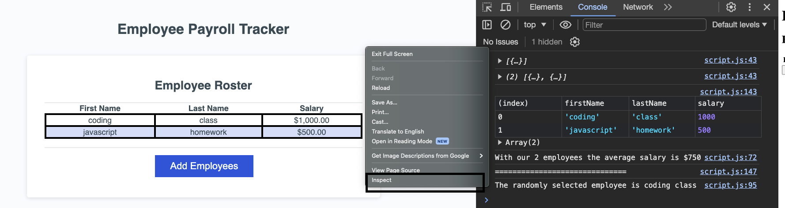

# payroll-javascript-hw3
Small Javascript project to track employee payroll. 

The project will complete three main objectives. 

1. Collect user input as first name, last name, and salary to display in a table in alphabetical order by last name. 

2. The input will then be logged to the console to calculate the average salary of all employees.

3. The program will randomly select an employee and display both their first and last name. 

## No Installation needed

visit the following deployed web application to use the employee tracker. 

https://soko77788.github.io/payroll-javascript-hw3/

## Usage

To use the application simply click the Add Employees button and the page will prompt you to start entering information. 

Clicking CANCEL at any point will end input. 

After entering salary the page will ask if you want to continue. To add another employee hit "Enter" on the keyboard or click "Ok". 

To observe the other 2 functions of the app after you fill out the user prompts. RIGHT CLICK and go to inspect. Click on the Console tab and you will be able to view the updated log of everthing that ran throught the program. 

You should see the amount of employees and average salary aswell as a random employee chosen with first and last name displayed. 

--Refer to screenshot below for guidance--

## Contributions, License, Credits

No contributions or license needed. Credit to the instructor Josh for getting the first Javascript function fully functional. 

## What I learned and Obstacles overcome

1. I learned how to make use of a while loop with a boolean flag. The hardest thing to overcome was the first function that wasn't breaking the loop when the cancel button was hit. 

2. Additional practice with a for loop with the new aspect being the user input was the data that was being collected and looped through an array.

3. To solve #2 I had to figure out how to target certain parts of an object in an array using dot notation. 

4. The 3rd function was similar. Once i figured out how to target parts of the object with dot notation i was able to display a message targeting only first and last names and not giving a salary number. 

5. Overall I gained alot of experince with functions, loops, arrays, objects, and prompts in this exercise. 

# Updates

The project is finished. No further updates will be made. 

